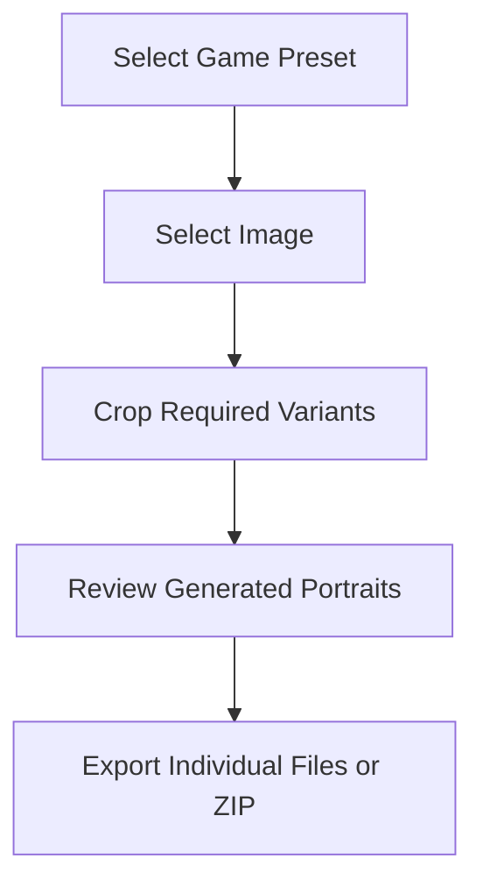

# Documentation

This document is the technical specification for developers and contributors building Crop & Quest.

## Related Documents

- [README.md](./README.md): Project overview and feature status.
- [CONTRIBUTING.md](./CONTRIBUTING.md): Setup instructions, commands, and contribution process.

## Product Specification

### Product Goal

Crop & Quest is a local-first portrait preparation tool for RPGs and CRPGs. The application takes one source image and exports correctly sized, correctly named portrait files for a selected game preset.

### Core Workflow



1. **Select Image**
   - User uploads a local PNG, JPEG, or WebP image (max 10MB and max 4096x4096 resolution to prevent canvas memory issues).
   - The application creates a local object URL for preview and editing.
   - Changing the source image mid-session resets all existing crops to prevent coordinate mismatch.
   - Unsupported formats via drag-and-drop, or corrupted/0-byte images, must trigger an explicit validation error. Dragged items must be validated as local files; cross-origin image URLs must be rejected to prevent CORS tainted canvas errors.

2. **Crop Variants**
   - The application guides the user sequentially through the `variants` array defined by the preset via "Next" and "Back" navigation.
   - Source images must have their EXIF orientation normalized before being passed to the cropper and canvas to prevent rotation mismatch.
   - Each crop is constrained to the variant's aspect ratio.
   - Optional variants can be bypassed using a "Skip" action. Skipped variants are omitted from the Review screen and the final ZIP archive; they do not block ZIP Export.
   - Browser back/forward navigation should be gracefully handled by the router to preserve `PortraitSession` state without resetting the crop progress.
   - User can pan, zoom, and position the image. The cropping UI must be responsive and optimized for mobile touch gestures.
   - If the source image is smaller than the required variant dimensions, upscaling is permitted but should display a subtle quality warning. If the user zooms out causing the image to not fully fill the crop box, the canvas export must use a solid black background fill to prevent transparency artifacts in formats lacking alpha channels.

3. **Review**
   - User sees each generated variant with preview, dimensions, filename, edit action, and export action.
   - ZIP Export is disabled if any non-optional variants are uncropped.
   - The UI must include a "Start Over" action to clear the session and return to image selection.

4. **Export**
   - User can download individual portraits.
   - User can download all variants as a ZIP. To prevent browser freezing from concurrent generation attempts, the "ZIP Export" button must immediately enter a disabled, visually distinct loading state when clicked.
   - If a browser blocks the automatic download, the export button state must persist so the user can manually re-trigger the download without regenerating the ZIP.
   - Exported files must use preset-defined filenames and the specified MIME type.

### Routes & Navigation

```txt
/                         Home
/create/[gameId]/select   Select source image
/create/[gameId]/[variant] Crop a specific portrait variant
/create/[gameId]/review   Review and export
/support                  Donation and support information
```

Editor routes share one portrait session through the editor layout. If a user visits a crop or review route without an image, redirect to that game's select step. Users navigate between variants sequentially, but must complete all non-optional variants to unlock global export.

### Error Scenarios & UX

The UI should handle edge cases with clear, actionable, and recoverable feedback written for non-technical users:

- **Invalid file type / unreadable image:** Show an error and prompt for a valid PNG, JPEG, or WebP. Explicitly validate against 0-byte files, and actively catch image `onerror` decode failures to surface a "Corrupted image data" error.
- **Missing image mid-session:** Redirect user back to the `/create/[gameId]/select` step.
- **Incomplete required crops:** Disable ZIP Export and highlight missing variants on the review screen.
- **Failed canvas export:** Display an error and suggest trying a smaller image. Object URLs must be immediately revoked upon encountering an error to prevent memory leaks before prompting the user to retry.
- **Failed ZIP generation (Memory Limits):** If ZIP generation fails (e.g., OOM on mobile), recommend the user download the individual files instead.
- **Unsupported browser APIs:** Display a clear message recommending a modern browser (Chrome, Firefox, Safari).

## Technical Architecture

### Tech Stack & Project Structure

The application uses Next.js, React, TypeScript, Tailwind CSS, Zustand, [react-easy-crop](https://github.com/ricardo-ch/react-easy-crop), and [JSZip](https://stuk.github.io/jszip/).

**Prerequisites:** Refer to [CONTRIBUTING.md](./CONTRIBUTING.md) for required Node version and package manager details.

Use feature-based organization:

```txt
src/app/                         routes, pages, layouts
src/components/ui/               generic UI primitives
src/components/layout/           site-wide layout components
src/features/game-presets/       preset data and helpers
src/features/portrait-editor/    cropper, session, canvas, export logic
src/hooks/                       generic shared hooks
src/lib/                         generic utilities
src/types/                       shared cross-feature types
```

### Runtime Model

- **Image upload**: Browser File API.
- **Preview**: `URL.createObjectURL`; revoke object URLs when no longer needed.
- **Crop UI**: `react-easy-crop`.
- **Processing**: Render selected crop area to a hidden `<canvas>`. The `<canvas>` must be explicitly hard-sized to the preset variant's exact `width` and `height` to prevent floating-point off-by-one pixel rounding errors. Developers must carefully implement precise matrix transformations when applying `rotation` state to the canvas context to avoid misaligned exports. For iOS Safari devices with strict canvas memory constraints, implement a progressive downscaling fallback if canvas context creation fails.
- **Export**: Convert canvas output to `Blob` utilizing the variant's `format` property to determine the precise MIME type (e.g., `image/png`). Client-side conversion libraries must be used to support BMP and TGA formats natively.
- **ZIP Export**: Bundle generated portrait blobs locally with `jszip`. Preset-defined filenames must be strictly sanitized to prevent path traversal or invalid OS characters before ZIP generation.

### Editor Session State

The editor session is ephemeral and client-side. If the user refreshes the page and the `imageFile` state is lost, the editor routes must gracefully catch this and redirect the user back to the `/create/[gameId]/select` step. Navigating to a new `/create/[gameId]/select` route must completely clear the previous `PortraitSession` to prevent state leakage between game presets.

Use Zustand for portrait editor session state. Because `imageFile` (File object) is non-serializable, avoid using Zustand DevTools or persistence middlewares for this slice to prevent runtime errors. Do not persist raw user image data by default.

```ts
export type CropStateMap = Record<string, CropState>;

export interface PortraitSession {
  gameId: string;
  imageFile: File | null;
  imageUrl: string | null;
  // Keys must correspond exactly to the 'key' strings defined in the current GamePreset's variants array
  crops: Partial<CropStateMap>;
}

export interface CropState {
  x: number;
  y: number;
  zoom: number;
  rotation: number;
  croppedAreaPixels?: {
    x: number;
    y: number;
    width: number;
    height: number;
  };
}
```

### Game Presets

Game presets define dimensions, aspect ratios, filenames, and game-specific notes. Presets should be plain TypeScript data that can be imported from server or client components. Note that both `key` and `filename` values inside the `variants` array must be strictly unique within a single preset to prevent state overwrites and ZIP file collisions.

```ts
export interface GamePreset {
  id: string;
  name: string;
  cover: StaticImageData;
  variants: PortraitVariant[];
  installNotes?: string;
  sourceUrl?: string;
}

export interface PortraitVariant {
  key: string;
  label: string;
  width: number;
  height: number;
  format: "png" | "jpeg" | "webp" | "bmp" | "tga";
  quality?: number; // 0.0 to 1.0 for lossy formats
  filename: string;
  optional?: boolean;
}
```

Example:

```ts
export const pathfinderKingmakerPreset: GamePreset = {
  id: "pathfinder-kingmaker",
  name: "Pathfinder: Kingmaker",
  variants: [
    {
      key: "large",
      label: "Large",
      width: 692,
      height: 1024,
      format: "png",
      filename: "Fulllength.png",
    },
    {
      key: "medium",
      label: "Medium",
      width: 330,
      height: 432,
      format: "png",
      filename: "Medium.png",
    },
    {
      key: "small",
      label: "Small",
      width: 185,
      height: 242,
      format: "png",
      filename: "Small.png",
    },
  ],
};
```

## Security & Privacy

The application avoids uploading images for cropping or export. This reduces privacy risk, but users should still avoid using sensitive images on untrusted devices or modified deployments. As a privacy benefit, exporting crops via HTML `<canvas>` inherently strips EXIF metadata (such as GPS coordinates) from the final images.

The application should not require:

- user accounts
- databases
- cloud storage
- server-side image processing

## Backlog

- Custom potrait naming
- Custom/free mode for unsupported games
- Custom preset builder
- Batch portrait creation
- Optional portrait reference links for supported games
