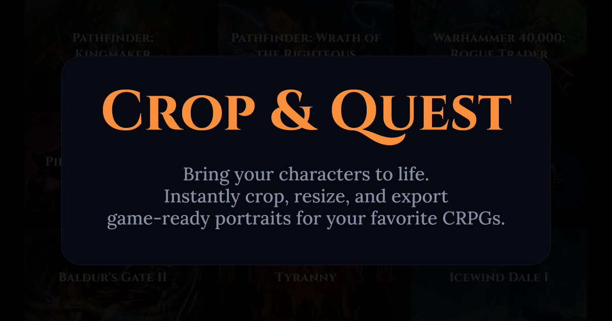

<div align="center">

# Crop & Quest



Every RPG has different, strict requirements for custom portraits—requiring specific dimensions, multiple variants, and exact filenames. Crop & Quest takes the hassle out of this by helping players turn any image into game-ready portrait files instantly.

Images are processed locally in the browser for cropping and export, no external server is used.

</div>

## Supported Games

Crop & Quest currently includes built-in presets with precise dimensions and auto-naming for:

- Pathfinder: Kingmaker & Wrath of the Righteous
- Warhammer 40,000: Rogue Trader
- Pillars of Eternity I & II
- Baldur's Gate I & II (Enhanced Editions)
- Icewind Dale I & II
- Neverwinter Nights 1 & 2
- Shadowrun (Returns, Dragonfall, Hong Kong)
- Wasteland 2 & 3
- Tyranny
- Planescape: Torment
- Arcanum: Of Steamworks and Magick Obscura

_Don't see your game? Use the **Custom format** to dial in exact dimensions, or open an issue to request a new preset!_

## Features

- Upload an image from your device
- Crop, zoom, and position portraits for specific game sizes
- Export individual portrait files
- Export all portrait variants as a ZIP
- Use game-specific portrait presets
- View per-game portrait requirements and notes

## Tech Stack

- **Framework:** [Next.js](https://nextjs.org/) (App Router)
- **UI:** [React](https://react.dev/), [Tailwind CSS v4](https://tailwindcss.com/)
- **State:** [Zustand](https://zustand-demo.pmnd.rs/)
- **Cropping Engine:** [react-easy-crop](https://github.com/ricardo-ch/react-easy-crop)
- **Exporting:** [JSZip](https://stuk.github.io/jszip/)

## Run Locally

Clone the project and start the development server:

```bash
pnpm install
pnpm run dev
```

Open [http://localhost:3000](http://localhost:3000) to view it in the browser.

## Legal Notice

Crop & Quest is an unofficial fan-made tool. It is not affiliated with, endorsed by, or sponsored by any game publisher, studio, or rights holder. Game names, trademarks, and related assets belong to their respective owners.

## License

This project is licensed under the [MIT](./LICENSE).
